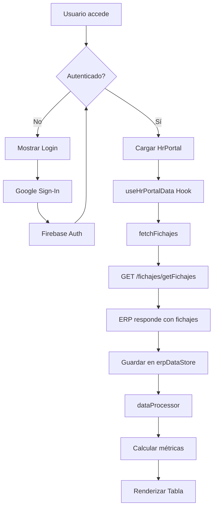
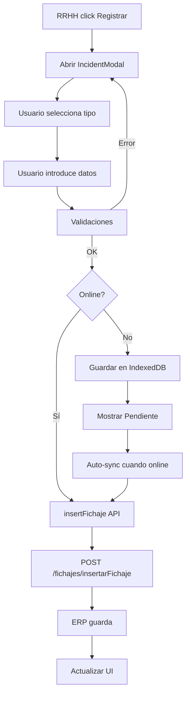
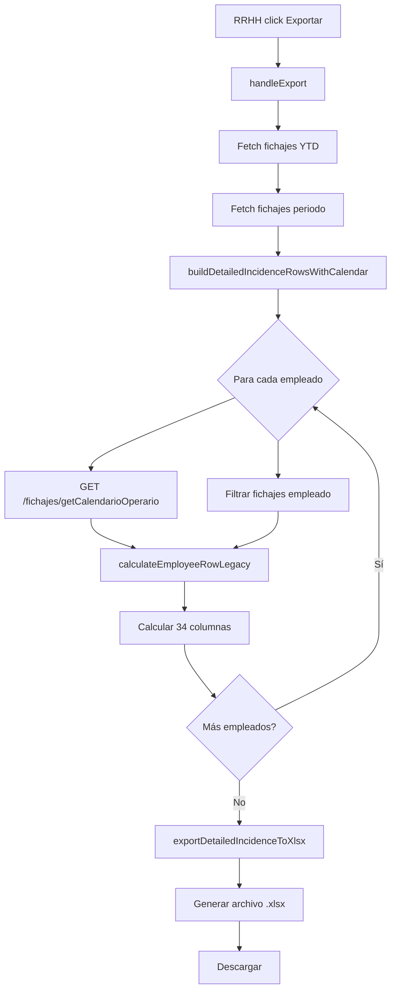
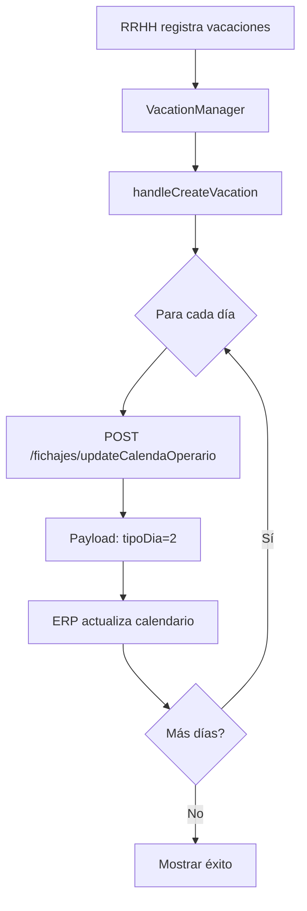

# DEFINICIÓN DEL PROYECTO - Sistema de Gestión de Presencia y RRHH

**Versión:** 2.0  
**Fecha:** Enero 2026  
**Autor:** Desarrollo Interno

---

## 📋 Índice

1. [Resumen Ejecutivo](#resumen-ejecutivo)
2. [Arquitectura Técnica](#arquitectura-técnica)
3. [Funcionalidad de la Aplicación](#funcionalidad-de-la-aplicación)
4. [Flujos de Datos Principales](#flujos-de-datos-principales)
5. [Componentes y Módulos](#componentes-y-módulos)
6. [Servicios y APIs](#servicios-y-apis)
7. [Gestión de Datos](#gestión-de-datos)
8. [Configuración y Despliegue](#configuración-y-despliegue)
9. [Reglas de Negocio](#reglas-de-negocio)
10. [Integración con ERP](#integración-con-erp)

---

## 1. Resumen Ejecutivo

### 1.1 ¿Qué es la Aplicación?

**Sistema de Gestión de Presencia y Recursos Humanos** es una aplicación web desarrollada en React + TypeScript que centraliza la gestión completa del control horario, ausencias, incidencias y nóminas de los empleados de una empresa.

### 1.2 Objetivo Principal

Automatizar y digitalizar el proceso de control de presencia, sustituyendo métodos manuales por un sistema integrado que:
- Registra fichajes (entradas/salidas)
- Gestiona ausencias (bajas, vacaciones, permisos)
- Calcula horas trabajadas y extras
- Genera informes para nóminas
- Proporciona visibilidad en tiempo real del estado de la plantilla

### 1.3 Usuarios

- **RRHH:** Gestión completa de incidencias, vacaciones, bajas
- **Dirección:** Visualización de datos agregados y reportes
- **Empleados:** (Futuro) Consulta de su propio estado

### 1.4 Tecnologías Core

```
Frontend:  React 19.2 + TypeScript 5.8
Build:     Vite 6.2
Backend:   ERP Corporativo (API REST)
DB Local:  IndexedDB (via Firebase)
Hosting:   Firebase Hosting
Auth:      Firebase Authentication (Google)
```

---

## 2. Arquitectura Técnica

### 2.1 Diagrama de Arquitectura

```
┌─────────────────────────────────────────────────────────────┐
│                     NAVEGADOR (Cliente)                      │
│                                                              │
│  ┌────────────────────────────────────────────────────────┐ │
│  │              React Application (SPA)                   │ │
│  │                                                        │ │
│  │  ├─ Components (UI)                                   │ │
│  │  ├─ Hooks (Lógica)                                    │ │
│  │  ├─ Services (APIs)                                   │ │
│  │  ├─ Store (Zustand)                                   │ │
│  │  └─ Workers (Heavy Processing)                        │ │
│  └────────────────────────────────────────────────────────┘ │
│                          ↓ ↑                                 │
│  ┌────────────────────────────────────────────────────────┐ │
│  │            IndexedDB (Almacenamiento Local)            │ │
│  │  - Fichajes en cola (offline)                         │ │
│  │  - Configuración                                      │ │
│  │  - Notificaciones                                     │ │
│  └────────────────────────────────────────────────────────┘ │
└─────────────────────────────────────────────────────────────┘
                          ↓ ↑
       ┌──────────────────────────────────────────┐
       │        Firebase Services (Cloud)         │
       │  - Authentication (Google Sign-In)       │
       │  - Hosting (Deployment)                  │
       └──────────────────────────────────────────┘
                          ↓ ↑
       ┌──────────────────────────────────────────┐
       │         ERP Corporativo (Backend)        │
       │  - /fichajes/getFichajes                 │
       │  - /fichajes/insertarFichaje             │
       │  - /fichajes/updateCalendaOperario       │
       │  - /fichajes/getCalendarioOperario       │
       │  - /fichajes/getMotivosAusencias         │
       │  - /fichajes/getOperarios                │
       └──────────────────────────────────────────┘
```

### 2.2 Arquitectura de Capas

#### Capa de Presentación (Components)
```
components/
├── hr/          → Portal RRHH (tabla principal, incidencias)
├── employee/    → Portal Empleado (futuro)
├── shared/      → Componentes reutilizables
└── core/        → Layouts y navegación
```

#### Capa de Lógica (Hooks)
```
hooks/
├── useHrPortalData.ts      → Gestión datos RRHH
├── useErp.ts               → Integración ERP
├── useProcessDataWorker.ts → Procesamiento pesado
└── useAutoRefresh.ts       → Sincronización automática
```

#### Capa de Servicios
```
services/
├── apiService.ts              → CRUD fichajes
├── erpApi.ts                  → Endpoints ERP específicos
├── dataProcessor.ts           → Procesamiento de datos
├── detailedIncidenceExportService.ts  → Excel nóminas (34 columnas)
├── syncService.ts             → Cola offline
└── validationService.ts       → Validaciones
```

#### Capa de Datos
```
store/
└── erpDataStore.ts  → Zustand store (estado global)

services/dbService.ts  → IndexedDB wrapper
```

### 2.3 Stack Tecnológico Detallado

| Categoría | Tecnología | Versión | Propósito |
|-----------|------------|---------|-----------|
| **Frontend Framework** | React | 19.2.0 | UI Components |
| **Lenguaje** | TypeScript | 5.8.2 | Type Safety |
| **Build Tool** | Vite | 6.2.0 | Dev Server + Bundling |
| **State Management** | Zustand | - | Global State |
| **Database Local** | IndexedDB | Native | Offline Storage |
| **Auth** | Firebase Auth | 12.6.0 | Google Sign-In |
| **Hosting** | Firebase Hosting | 12.6.0 | Deployment |
| **Excel Export** | XLSX | 0.18.5 | Reportes Excel |
| **AI Integration** | Google Gemini | 1.29.0 | OCR Albaranes |
| **Virtual Lists** | react-window | 1.8.10 | Performance |

---

## 3. Funcionalidad de la Aplicación

### 3.1 Módulos Principales

#### 📊 **Portal RRHH** (Módulo Central)

**Ubicación:** `components/hr/HrPortal.tsx`

**Funcionalidades:**

1. **Vista Principal - Tabla de Presencia**
   - Muestra todos los empleados del día/rango seleccionado
   - Columnas: Estado, Nombre, Departamento, Turno, Entrada, Salida
   - Filtros: Fecha, Departamento, Turno, Empleado específico
   - Indicadores visuales:
     - 🟢 Verde: Fichaje completo sin incidencias
     - 🔴 Rojo: Ausencias o incidencias
     - 🟡 Amarillo: Fichaje parcial
   - Acciones por fila:
     - Botón "Registrar Incidencia"
     - Botón "Ajuste Manual"
     - Botón "Justificar Retraso"

2. **Gestión de Incidencias**
   - Modal para registrar/editar incidencias
   - Tipos de incidencias (códigos):
     - 02: Médico (16h anuales)
     - 03: Asuntos Oficiales
     - 05: Vacaciones (22 días anuales)
     - 06: Especialista/Accidente
     - 07: Libre Disposición (8h anuales)
     - 08: Vacaciones Año Anterior
     - 09: Horas Sindicales
     - 10: ITAT (Baja por IT - Accidente Trabajo)
     - 11: ITEC (Baja por IT - Enfermedad Común)
     - 13: Ley de Familias (32h anuales)
     - 14: TAJ (Salidas a fumar/torno)
   
3. **Gestión de Vacaciones**
   - Calendario visual de vacaciones planificadas
   - Registro de vacaciones por empleado y rango de fechas
   - Consulta calendario personal via `/fichajes/getCalendarioOperario`
   - Actualización calendario via `/fichajes/updateCalendaOperario`
   - Exportación a Excel de gestión de vacaciones
   
4. **Gestión de Bajas**
   - **Bajas Activas:** En curso, sin fecha de alta
   - **Histórico de Bajas:** Cerradas, con fecha de alta
   - Tipos: ITAT (10) e ITEC (11)
   - Duración calculada automáticamente
   - Sincronización entre tablas activas/históricas

5. **Incidencias Futuras**
   - Pre-registro de incidencias para fechas futuras
   - Útil para planificar ausencias conocidas de antemano
   - Aparecen automáticamente cuando llega la fecha

6. **Exportaciones**
   - **Excel de Nóminas** (34 columnas):
     - Consulta calendario por empleado
     - Calcula horas trabajadas, ausencias, créditos
     - YTD (Year-to-Date) acumulados
     - Formato listo para nóminas
   - **Excel de Horas Libres**:
     - Detalle de Libre Disposición por empleado
     - Acumulados y disponibles

#### 👤 **Portal Empleado** (Futuro)

**Ubicación:** `components/employee/EmployeePortal.tsx`

**Funcionalidades Planificadas:**
- Consulta de fichajes propios
- Solicitud de vacaciones
- Consulta de créditos (médico, libre disposición, etc.)

#### 🔐 **Autenticación**

**Ubicación:** `components/LoginComponent.tsx`

- Login con Google (Firebase Auth)
- Control de acceso por dominio corporativo
- Sesión persistente

### 3.2 Características Técnicas Destacadas

#### 🚀 **Modo Offline**

- Cola de fichajes pendientes en IndexedDB
- Sincronización automática al recuperar conexión
- Indicador visual de: Online / Offline / Sincronizando

#### ⚡ **Optimización de Rendimiento**

- Web Workers para procesamiento pesado (`workers/dataProcessorWorker.ts`)
- Virtualización de listas con `react-window` (50+ filas)
- Memoización de cálculos costosos

#### 🔄 **Sincronización Automática**

- Auto-refresh cada 2 minutos (`useAutoRefresh.ts`)
- Consulta `/fichajes/getFichajes` periódicamente
- Actualiza UI sin recargar página

#### 🤖 **Integración IA (Gemini)**

- OCR de albaranes para auditoría (futuro)
- Extracción de datos de documentos PDF
- Validación automática

---

## 4. Flujos de Datos Principales

### 4.1 Flujo de Carga Inicial



### 4.2 Flujo de Registro de Incidencia



### 4.3 Flujo de Exportación Excel Nóminas



### 4.4 Flujo de Gestión de Vacaciones



---

## 5. Componentes y Módulos

### 5.1 Estructura de Componentes

```
components/
│
├── hr/                                    # Portal RRHH
│   ├── HrPortal.tsx                      # Componente principal
│   ├── DataTable.tsx                     # Tabla de fichajes
│   ├── IncidentManager.tsx               # Gestión incidencias
│   ├── VacationManager.tsx               # Gestión vacaciones
│   ├── SickLeaveManager.tsx              # Gestión bajas
│   ├── FutureAbsenceManager.tsx          # Incidencias futuras
│   ├── IncidentHistoryPanel.tsx          # Historial
│   ├── AusenciasTable.tsx                # Tabla ausencias
│   ├── ActiveSickLeavesTable.tsx         # Bajas activas
│   ├── SickLeaveHistoryTable.tsx         # Historial bajas
│   ├── EditLeaveModal.tsx                # Modal edición vacaciones
│   └── modals/                           # Modales varios
│       ├── IncidentModal.tsx
│       ├── ManualAdjustmentModal.tsx
│       ├── LateArrivalModal.tsx
│       ├── FreeHoursModal.tsx
│       └── FutureIncidentModal.tsx
│
├── employee/                              # Portal Empleado
│   └── EmployeePortal.tsx                # (Futuro)
│
├── shared/                                # Componentes compartidos
│   ├── Nav.tsx                           # Barra navegación
│   ├── NotificationContext.tsx           # Sistema notificaciones
│   ├── EmployeeSelect.tsx               # Selector empleados
│   ├── AdvancedEmployeeFilter.tsx       # Filtros avanzados
│   └── IncidentLogTable.tsx              # Tabla log incidencias
│
└── core/                                  # Núcleo
    └── ServerConnectionMonitor.tsx       # Monitor conexión
```

### 5.2 Hooks Personalizados

| Hook | Archivo | Propósito |
|------|---------|-----------|
| `useHrPortalData` | `useHrPortalData.ts` | Gestión completa datos RRHH, filtros, exportaciones |
| `useErp` | `useErp.ts` | Integración con endpoints ERP |
| `useAutoRefresh` | `useAutoRefresh.ts` | Sincronización automática periódica |
| `useProcessDataWorker` | `useProcessDataWorker.ts` | Delegación a Web Worker |
| `useNotification` | Dentro de `NotificationContext.tsx` | Sistema de notificaciones toast |

### 5.3 Servicios

#### **apiService.ts**
Servicios CRUD para fichajes:
- `fetchFichajes()` - GET fichajes por rango
- `insertFichaje()` - POST nuevo fichaje/incidencia
- `updateFichaje()` - PUT actualización fichaje
- `deleteFichaje()` - DELETE fichaje

#### **erpApi.ts**
Endpoints ERP específicos:
- `getMotivosAusencias()` - Catálogo de motivos
- `getCalendarioEmpresa()` - Calendario empresa
- `getCalendarioOperario()` - Calendario personal empleado
- `updateCalendarioOperario()` - Actualizar calendario (vacaciones)
- `getOperarios()` - Listado operarios

#### **dataProcessor.ts**
Procesamiento y cálculos:
- `processData()` - Procesa fichajes brutos → datos enriquecidos
- Cálculo de horas trabajadas, retrasos, ausencias
- Detección automática de incidencias
- Aplicación de reglas de negocio

#### **detailedIncidenceExportService.ts**
**Excel de Nóminas (LO MÁS CRÍTICO)**:
- `buildDetailedIncidenceRowsWithCalendar()` - Generación con calendario
- `buildDetailedIncidenceRows()` - Generación legacy
- `exportDetailedIncidenceToXlsx()` - Creación archivo Excel
- 34 columnas según especificación `08_excel_nominas_columnas.md`

#### **syncService.ts**
Gestión cola offline:
- `queueFichaje()` - Encolar fichaje
- `syncQueue()` - Sincronizar cola
- `retryFailedItems()` - Reintentar fallidos

#### **validationService.ts**
Validaciones de negocio:
- Validación de rangos horarios
- Validación de solapamientos
- Validación de créditos disponibles

---

## 6. Servicios y APIs

### 6.1 Endpoints ERP Consumidos

#### GET `/fichajes/getFichajes`

**Descripción:** Obtiene fichajes de un rango de fechas

**Parámetros:**
```typescript
{
  fechaDesde: string,  // DD/MM/YYYY
  fechaHasta: string,  // DD/MM/YYYY
  idOperario: string,  // (opcional) filtrar por empleado
  horaDesde: string,   // HH:mm (opcional)
  horaHasta: string    // HH:mm (opcional)
}
```

**Respuesta:**
```typescript
RawDataRow[] = {
  IDControlPresencia: number,
  DescDepartamento: string,
  IDOperario: number,
  DescOperario: string,
  Fecha: string,           // YYYY-MM-DD
  Hora: string,            // HH:mm:ss
  Entrada: 0 | 1,          // 0=Salida, 1=Entrada
  MotivoAusencia: number | null,
  DescMotivoAusencia: string,
  Computable: "Sí" | "No",
  IDTipoTurno: string | null,
  Inicio: string,          // HH:mm
  Fin: string,             // HH:mm
  TipoDiaEmpresa: 0 | 1 | 2,  // 0=Laborable, 1=Festivo, 2=Vacaciones
  TurnoTexto: string
}
```

#### POST `/fichajes/insertarFichaje`

**Descripción:** Inserta nuevo fichaje o incidencia

**Payload:**
```typescript
{
  IDOperario: number,
  Fecha: string,           // DD/MM/YYYY
  Hora: string,            // HH:mm:ss
  Entrada: 0 | 1,
  MotivoAusencia: number | null,
  DescMotivoAusencia: string,
  Usuario: string          // Usuario que registra
}
```

#### POST `/fichajes/updateCalendaOperario`

**Descripción:** Actualiza calendario personal empleado (vacaciones)

**Payload:**
```typescript
{
  idOperario: string,      // 3 dígitos: "049"
  fecha: string,           // DD/MM/YYYY
  tipoDia: 0 | 1 | 2 | null  // 0=Laborable, 1=Festivo, 2=Vacaciones, null=Quitar
}
```

#### GET `/fichajes/getCalendarioOperario`

**Descripción:** Obtiene calendario personal empleado

**Parámetros:**
```typescript
{
  idOperario: string,      // 3 dígitos
  fechaDesde: string,      // DD/MM/YYYY
  fechaHasta: string       // DD/MM/YYYY
}
```

**Respuesta:**
```typescript
CalendarioDia[] = {
  Fecha: string,           // YYYY-MM-DD
  TipoDia: "0" | "1" | "2",
  DescTipoDia: string,
  IDTipoTurno: string | null,
  DescTurno: string,
  Duracion: number         // Horas del turno
}
```

#### GET `/fichajes/getMotivosAusencias`

**Descripción:** Catálogo de motivos de ausencia

**Respuesta:**
```typescript
MotivoAusencia[] = {
  IDMotivo: string,
  DescMotivo: string,
  Computable: boolean
}
```

#### GET `/fichajes/getOperarios`

**Descripción:** Lista de operarios

**Parámetros:**
```typescript
{
  activo: boolean  // Filtrar solo activos
}
```

**Respuesta:**
```typescript
Operario[] = {
  IDOperario: number,
  DescOperario: string,
  IDDepartamento: number,
  DescDepartamento: string,
  Activo: boolean
}
```

### 6.2 Configuración de API

**Archivo:** `config/apiConfig.ts`

```typescript
export const getApiBaseUrl = (): string => {
  // Desarrollo
  if (import.meta.env.DEV) {
    return 'http://192.168.1.100:8000';
  }
  
  // Producción
  return import.meta.env.VITE_API_BASE_URL || 'https://erp.empresa.com/api';
};
```

**Variables de entorno** (`.env.local`):
```
VITE_API_BASE_URL=https://erp.empresa.com/api
VITE_FIREBASE_API_KEY=...
VITE_FIREBASE_AUTH_DOMAIN=...
```

---

## 7. Gestión de Datos

### 7.1 Tipos de Datos Principales

**Archivo:** `types.ts`

```typescript
// Fichaje bruto del ERP
export interface RawDataRow {
  IDControlPresencia: number;
  DescDepartamento: string;
  IDOperario: number;
  DescOperario: string;
  Fecha: string;
  Hora: string;
  Entrada: 0 | 1;
  MotivoAusencia: number | null;
  DescMotivoAusencia: string;
  Computable: "Sí" | "No";
  IDTipoTurno: string | null;
  Inicio: string;
  Fin: string;
  TipoDiaEmpresa: 0 | 1 | 2;
  TurnoTexto: string;
}

// Dato procesado para UI
export interface ProcessedDataRow {
  id: number;
  operario: number;
  nombre: string;
  colectivo: string;
  turnoAsignado: 'M' | 'TN';
  estado: string;
  horasTrabajadas: number;
  entrada: string;
  salida: string;
  absentDays: string[];
  lateMinutes: number;
  incidentCount: number;
}

// Usuario
export interface User {
  id: number;
  name: string;
  role: Role;
  department: string;
}

export enum Role {
  RRHH = 'RRHH',
  Employee = 'Employee',
  Management = 'Management'
}

// Turno
export interface Shift {
  id: string;
  name: string;
  start: string;  // HH:mm
  end: string;    // HH:mm
}

// Baja médica
export interface SickLeave {
  id: number;
  employeeId: number;
  employeeName: string;
  type: 'ITAT' | 'ITEC';
  startDate: string;
  endDate: string | null;  // null = activa
  duration: number;
}
```

### 7.2 Estado Global (Zustand)

**Archivo:** `store/erpDataStore.ts`

```typescript
interface ErpDataStore {
  erpData: RawDataRow[];         // Fichajes cargados
  setErpData: (data: RawDataRow[]) => void;
}

export const useErpDataState = () => {
  const { erpData } = useErpDataStore();
  return { erpData };
};

export const useErpDataActions = () => {
  const { setErpData } = useErpDataStore();
  return { setErpData };
};
```

### 7.3 Persistencia Local (IndexedDB)

**Archivo:** `services/dbService.ts`

**Tablas:**

1. **fichajes_queue** - Cola de fichajes pendientes
```typescript
{
  id: number (auto),
  fichaje: RawDataRow,
  timestamp: number,
  attempts: number,
  error: string | null
}
```

2. **notifications** - Notificaciones persistentes
```typescript
{
  id: string,
  message: string,
  type: 'success' | 'error' | 'warning' | 'info',
  timestamp: number,
  read: boolean
}
```

3. **config** - Configuración app
```typescript
{
  key: string,
  value: any
}
```

---

## 8. Configuración y Despliegue

### 8.1 Configuración Firebase

**Archivo:** `firebaseConfig.ts`

```typescript
const firebaseConfig = {
  apiKey: import.meta.env.VITE_FIREBASE_API_KEY,
  authDomain: import.meta.env.VITE_FIREBASE_AUTH_DOMAIN,
  projectId: import.meta.env.VITE_FIREBASE_PROJECT_ID,
  storageBucket: import.meta.env.VITE_FIREBASE_STORAGE_BUCKET,
  messagingSenderId: import.meta.env.VITE_FIREBASE_MESSAGING_SENDER_ID,
  appId: import.meta.env.VITE_FIREBASE_APP_ID
};
```

### 8.2 Build y Despliegue

**Desarrollo:**
```bash
npm run dev        # Vite dev server en http://localhost:5173
```

**Producción:**
```bash
npm run build      # Genera dist/
firebase deploy    # Deploy a Firebase Hosting
```

**Script de inicio rápido:**
`INICIAR APP.bat`:
```batch
@echo off
start cmd /k "npm run dev"
timeout /t 3
start http://localhost:5173
```

### 8.3 Estructura de Build

```
dist/
├── index.html
├── assets/
│   ├── index-[hash].js      # Bundle JavaScript
│   └── index-[hash].css     # Estilos
└── firebase.json            # Config Firebase Hosting
```

---

## 9. Reglas de Negocio

### 9.1 Códigos de Ausencia

| Código | Nombre | Crédito Anual | Unidad | Computable |
|--------|--------|---------------|--------|------------|
| 00/01 | Fichaje Normal | - | - | Sí |
| 02 | Médico | 16 | Horas | Sí |
| 03 | Asuntos Oficiales | - | Horas | Sí |
| 05 | Vacaciones | 22 | Días | Sí |
| 06 | Especialista/Accidente | - | Horas | Sí |
| 07 | Libre Disposición | 8 | Horas | Sí |
| 08 | Vacaciones Año Anterior | - | Días | Sí |
| 09 | Horas Sindicales | - | Horas | Sí |
| 10 | ITAT (Baja IT Accidente) | - | Horas | No |
| 11 | ITEC (Baja IT Enfermedad) | - | Horas | No |
| 13 | Ley de Familias | 32 | Horas | Sí |
| 14 | TAJ (Salidas) | - | Horas | Sí* |

*TAJ se contabiliza pero se resta de horas trabajadas

### 9.2 Turnos

```typescript
// Turno Mañana (M)
{
  id: 'M',
  name: 'Mañana',
  start: '07:00',
  end: '15:00',
  duration: 8
}

// Turno Tarde/Noche (TN)
{
  id: 'TN',
  name: 'Tarde',
  start: '15:00',
  end: '23:00',
  duration: 8
}
```

### 9.3 Cálculo de Horas Trabajadas

**Según:** `.agent/rules/08_excel_nominas_columnas.md`

1. **Trabajo Real** = Fichajes con `MotivoAusencia` null/0/1 O `TipoDiaEmpresa = 2`

2. **Horas Día** (07:00-15:00):
   - Intersección fichajes con rango
   - MENOS tiempo TAJ (código 14) en ese rango

3. **Exceso Jornada 1** (15:00-19:59):
   - Solo turno Mañana (M)
   - Horas extras después de jornada

4. **Horas Tarde** (15:00-23:00):
   - Intersección fichajes
   - MENOS TAJ

5. **Nocturnas** (20:00-06:00):
   - Solo turno M trabajando fuera de horario

6. **Horas Noche** (23:00-07:00):
   - Turno Noche
   - MENOS TAJ

7. **Festivas**:
   - Si día es festivo, TODO el tiempo va ahí
   - Anula Día/Tarde/Noche

### 9.4 Cálculo de Retrasos

**Regla:**
- Turno M: Esperado 07:00, margen 1min 59seg
- Turno TN: Esperado 15:00, margen 1min 59seg
- Solo cuenta PRIMERA entrada normal del día
- Si entrada > esperado + margen → RETRASO

**Ejemplo:**
```
Turno M, Primera entrada: 07:03
Esperado: 07:00
Margen: 07:01:59
07:03 > 07:01:59 → RETRASO de 3 minutos
```

### 9.5 Vacaciones

**Registro:**
1. RRHH selecciona empleado y rango
2. Para cada día: `POST /fichajes/updateCalendaOperario`
3. `tipoDia: 2` (vacaciones)

**Efecto:**
- En Excel Nóminas: Cuenta como día trabajado (8h)
- No aparece en tabla ausencias
- Se gestiona desde calendario

**Eliminación:**
- Mismo endpoint con `tipoDia: null`

---

## 10. Integración con ERP

### 10.1 Flujo de Sincronización

```
App                         ERP
 │                           │
 ├─ GET /fichajes/getFichajes
 │                           ├─ Query DB
 │                           ├─ Return data
 │ ←─────────────────────────┤
 │                           │
 ├─ Process data             │
 ├─ Render UI                │
 │                           │
 ├─ User registers incident  │
 ├─ POST /fichajes/insertarFichaje
 │                           ├─ Validate
 │                           ├─ Insert DB
 │ ←─ Success ───────────────┤
 │                           │
 ├─ Show notification        │
 ├─ Refresh data             │
 └─ GET /fichajes/getFichajes│
                             │
```

### 10.2 Manejo de Errores

**Timeout:** 10 segundos por defecto

**Códigos de Error:**
- 401: No autorizado → Relogin
- 404: Endpoint no encontrado → Notificar RRHH
- 500: Error servidor → Reintentar 3 veces
- Network error: → Cola offline

**Estrategia de Reintento:**
```typescript
async function fetchWithRetry(fn, maxRetries = 3) {
  for (let i = 0; i < maxRetries; i++) {
    try {
      return await fn();
    } catch (error) {
      if (i === maxRetries - 1) throw error;
      await wait(1000 * (i + 1)); // Exponential backoff
    }
  }
}
```

### 10.3 Formato de Fechas

**App → ERP:**
```
YYYY-MM-DD → DD/MM/YYYY
2026-01-16 → 16/01/2026
```

**ERP → App:**
```
YYYY-MM-DD HH:mm:ss → YYYY-MM-DD
2026-01-16 00:00:00 → 2026-01-16
```

---

## 📚 Documentación Adicional

### Archivos de Referencia

- `.agent/rules/01_navegacion.md` - Reglas de navegación
- `.agent/rules/06_gestio_fichajes.md` - Gestión fichajes
- `.agent/rules/08_excel_nominas_columnas.md` - **Especificación 34 columnas**
- `AUDIT_REPORT.md` - Auditoría interna

### Logs y Debugging

**Console Logs:**
```javascript
console.log('📅 [Excel] ...') // Excel export
console.log('🔄 [Sync] ...')  // Sincronización
console.log('❌ [API] ...')    // Errores API
console.log('✅ [API] ...')    // Éxitos API
```

---

## 🔐 Seguridad

- Autenticación: Firebase (Google)
- Autorización: Por dominio corporativo
- Datos sensibles: Solo en memoria, no localStorage
- API: HTTPS obligatorio en producción
- IndexedDB: Encriptación nativa del navegador

---

## ⚡ Performance

- Web Workers: Procesamiento pesado
- Virtual Lists: 50+ filas
- Memoización: `useMemo` en cálculos complejos
- Code Splitting: Importación dinámica
- Caching: Calendarios (5 min TTL)

---

## 📊 Métricas Clave

- **Usuarios concurrentes:** ~10-20
- **Fichajes/día:** ~200-300
- **Tiempo carga inicial:** <2s
- **Tiempo exportación Excel (100 empleados):** ~3s
- **Sincronización automática:** Cada 2 min

---

**Versión del Documento:** 1.0  
**Última Actualización:** 16/01/2026  
**Mantenido por:** Equipo Desarrollo Interno
